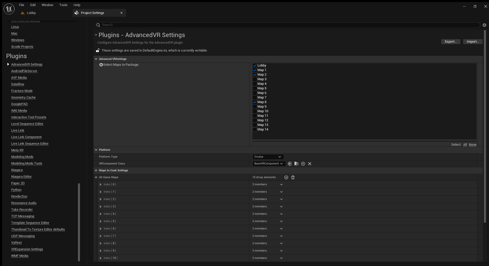

# AdvancedVR
**AdvancedVR** is a utility plugin for Unreal Engine designed to give developers greater control over VR build configurations. It allows you to enable or disable specific maps and plugins based on your target platform during packaging.

---

## Features

- Quickly select which maps are included in the packaged build
- Enable/disable Unreal plugins per platform (Windows, Android, etc.)
- Useful for conditional dependencies like 'OnlineSubsystem', 'OpenXR', or 'CustomVRPlugins'

---
